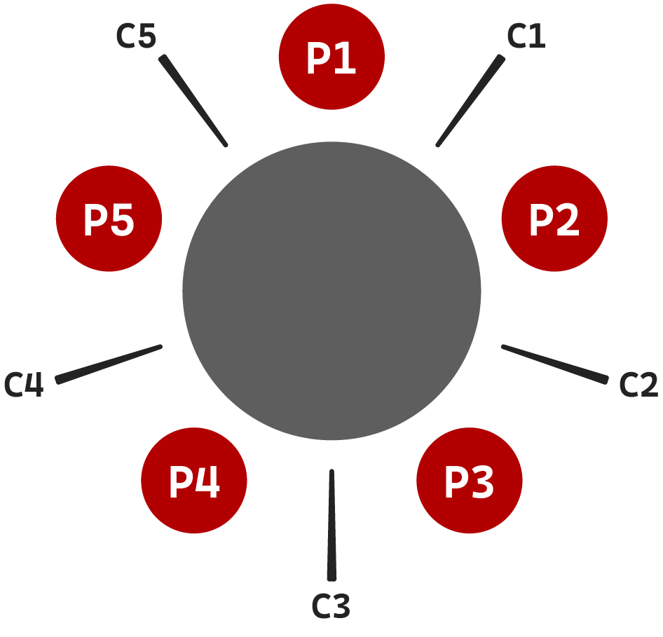

# Dining Philosophers Problem

**As stated on Wikipedia:**

> In computer science, the dining philosophers problem is an example problem often used in concurrent algorithm design to illustrate synchronization issues and techniques for resolving them.

> Five philosophers dine together at the same table. Each philosopher has his own plate at the table. There is a fork between each plate. The dish served is a kind of spaghetti which has to be eaten with two forks. Each philosopher can only alternately think and eat. Moreover, a philosopher can only eat his spaghetti when he has both a left and right fork. Thus two forks will only be available when his two nearest neighbors are thinking, not eating. After an individual philosopher finishes eating, he will put down both forks. The problem is how to design a regimen (a concurrent algorithm) such that any philosopher will not starve; i.e., each can forever continue to alternate between eating and thinking, assuming that no philosopher can know when others may want to eat or think (an issue of incomplete information).

(I replaced forks with chopsticks, but the concept remains the same, obviously)

Further details can be found directly on the [Wikipedia page](https://en.wikipedia.org/wiki/Dining_philosophers_problem). I have implemented several canonical solutions to the DPP [here](https://github.com/m4jr0/dining-philosophers-problem/tree/main/src/solutions).

The project uses CMake and is expected to be compatible with, at the very least, MSVC and GCC.